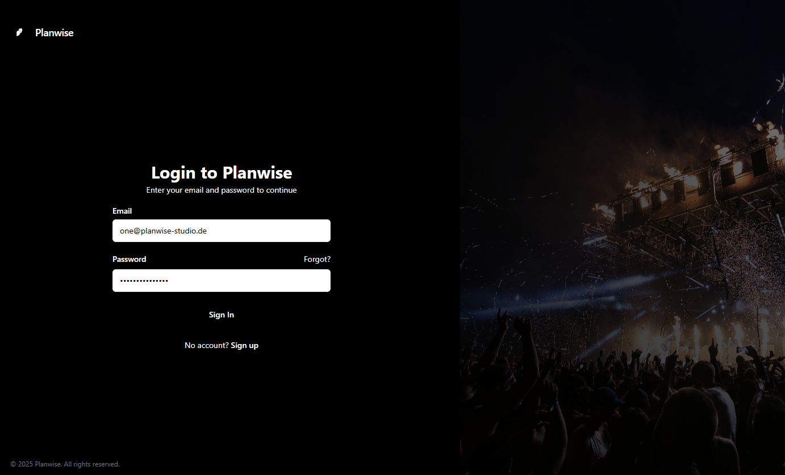

# 🌟 Planwise
> 🧰 Planwise is a shift scheduler for festivals

<p align="center">
  
</p>

[⬇️ Download (Release)](./releases/latest) · [🐛 Report Bug](./issues/new?labels=bug) · [💡Suggest a feature](./issues/new?labels=enhancement)

---

## ✨ Features
- 🧩 Save profiles & loadouts
- 🔄 (Optional) Auto-Update & Integrity Checks
- 🖥️ Cross-Platform (Win/macOS/Linux)

---

## 🚀 Quick start

**Requirements:** Node ≥ 18 · Docker · Prisma · Bun

```bash
npm install
cp .env.example .env
npx @better-auth/cli@latest generate --config src/auth/auth.ts
npx @better-auth/cli@latest migrate  --config src/auth/auth.ts
docker compose up -d
#pnpm -C apps/api prisma db push
npm run dev
```

.env (Example)
```env
DB_HOST=127.0.0.1
DB_PORT=3306
DB_USER=root
DB_PASSWORD=pass
DB_NAME=planwise
AUTH_COOKIE_SECURE=false
```
---

## 🏗️ Structure

apps/
  desktop/   # Tauri + React (Haupt-App)
  web/       # Astro (Website/Docs)
packages/
  core/      # Mod-Logik
  ui/        # UI-Komponenten
  types/     # Shared Types
docs/
  screenshots/

## 🛠️ Useful commands
```bash
pnpm run dev
pnpm run lint
pnpm run test
pnpm -C apps/desktop tauri build
http://localhost:4321
```

## 📸 Screenshots

🖼️ Landingpage


🧩 Login


🧱 Dashboard


📝 Editor


## 🐋 Docker Compose 
```
services:
  db:
    image: mariadb:latest
    container_name: planwise-db
    restart: unless-stopped
    environment:
      MARIADB_DATABASE: ${DB_NAME:-planwise}
      MARIADB_USER: ${DB_USER:-planwise}
      MARIADB_PASSWORD: ${DB_PASSWORD:-planwise}
      MARIADB_ROOT_PASSWORD: ${DB_ROOT_PASSWORD:-root}
    volumes:
      - ./db_data:/var/lib/mysql
    healthcheck:
      test: ["CMD-SHELL", "mysqladmin ping -h 127.0.0.1 -uroot -p$${MARIADB_ROOT_PASSWORD} || exit 1"]
      interval: 10s
      timeout: 5s
      retries: 5
      start_period: 20s
    networks:
      - planwise-internal
      - planwise-external
    ports:
      - 3306:3306

  phpmyadmin:
    image: phpmyadmin:latest
    container_name: planwise-phpmyadmin
    restart: unless-stopped
    environment:
      PMA_HOST: db
      PMA_PORT: 3306
    ports:
      - "8080:80"
    depends_on:
      - db
    networks:
      - planwise-internal
      - planwise-external

#  planwise:
#    build:
#      context: .
#      dockerfile: ../dockerfile
#    container_name: planwise-app
#    restart: unless-stopped
#    environment:
#      DB_HOST: db
#      DB_PORT: 3306
#      DB_NAME: ${DB_NAME:-planwise}
#      DB_USER: ${DB_USER:-planwise}
#      DB_PASSWORD: ${DB_PASSWORD:-planwise}
#    depends_on:
#      - db
#    ports:
#      - "80:4321"
#    networks:
#      - planwise-internal
#      - planwise-external

networks:
  planwise-internal:
    internal: true
  planwise-external:
    external: true
```
## 🤝 Contribute
git checkout -b feature/<name>
git commit -m "feat: <short description>"
git push origin feature/<name>

## 📦 Build & Release
pnpm run build

## 🧾 License & Notice
GNU GENERAL PUBLIC LICENSE
